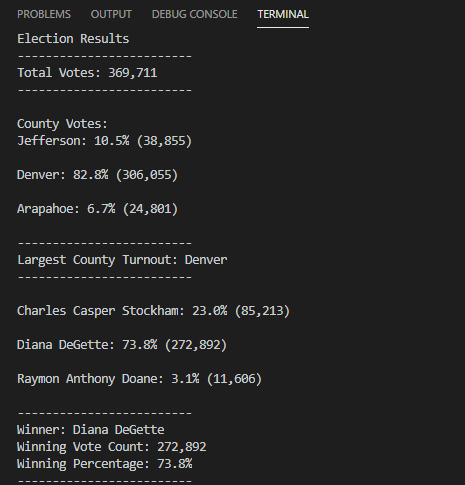
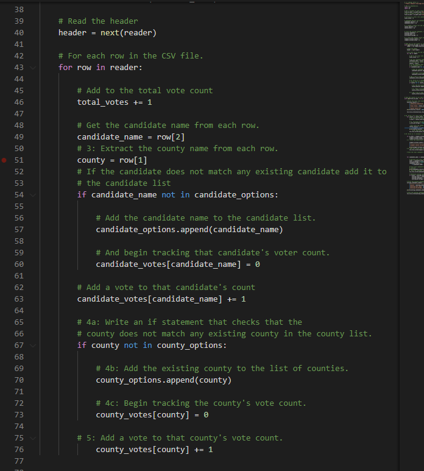
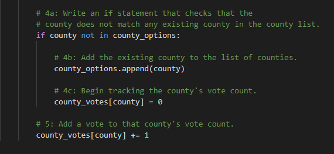

# Election_Analysis

## Project Overview
### Overview of Election Audit

A manager and his employee has required some additional information to finish the election audit results and send it to the commission. There are three core essential part that needs to be focused which are:
1. The voter turnout for each county
2. The percentage of votes from each county out of the total count
3. The county with the highest turnout.

## Resources
-Data Source: election_results.csv
-Software: Python 3.9.1, Visual Studio Code, 1.52.1

## Summary

### Election Audit Results

As can be seen from the analysis that:
- There were 369,711 votes cast in the election
- The candidate were:
    - Charles Casper Stockham
    - Diana DeGette
    - Raymon Anthony Doane 
- The vote results for each county:
    - Jefferson county received 38,855 votes
    - Denver county received 306,055
    - Arapahoe county received 24,801
- The percentage of votes from each county
    - Jefferson county received 10.5 % of the vote
    - Denver county received 82.8 % of the vote
    - Arapahoe county received 6.7 % of the vote
- Based on the result, the county with highest turnout will be:
    - Denver which received 82.8 % and 306,055 votes
- The candidate results were:
    - Charles Casper Stockham received 23.0% of the vote and 85,213 number of votes
    - Diana DeGette received 73.8 % of the vote and 272,892 number of votes
    - Raymon Anthony Doane received 3.1 % of the vote and 11,606 number of votes
-  Therefore, the winner of the election was:
    - Diana DeGette, who received 73.8 % of the vote and 272,892 number of votes

### Election Audit Summary 

In this case, we can use the input() built-in method to get the input from user so that we can check the votes for each candidates we want instead of showing the whole dataset.
Another one is that we can add more code lines to check the votes for state instead of county.

## Challenge Overview

It's not really complicated as the pseudocode lines have shown steps-by-steps. Therefore, it is easier for us to build the code. However, I faced a challenge about using tab and spacebar. In VBA, we have Start and End command so that the tab does not affect the result of the code significantly. 
It took me 2 days to recognize that I use the wrong 'tab' in my code work, so the code did not run correctly. 

## Challenge Summary

I now focus on using the tab and spacebar for all of my codes. It can be seen in this pic about my code. 

